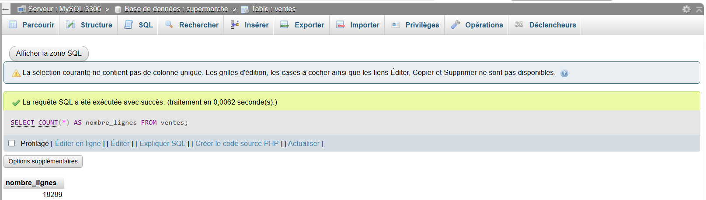
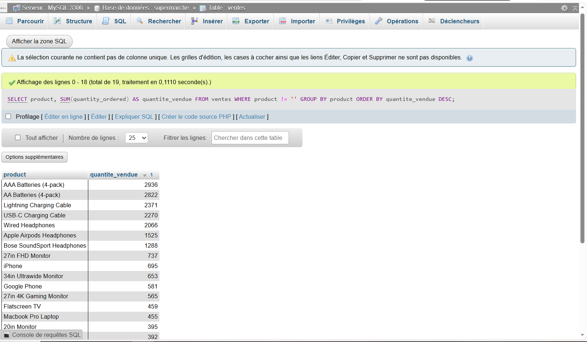
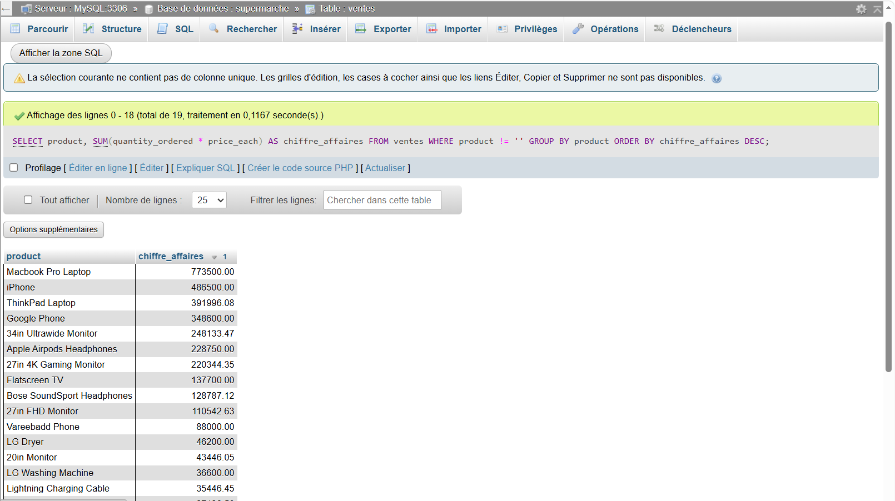
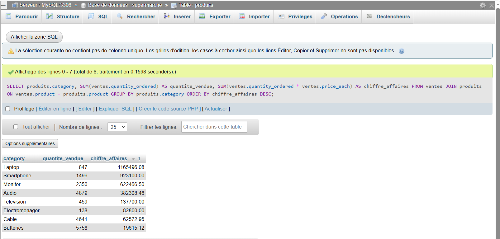
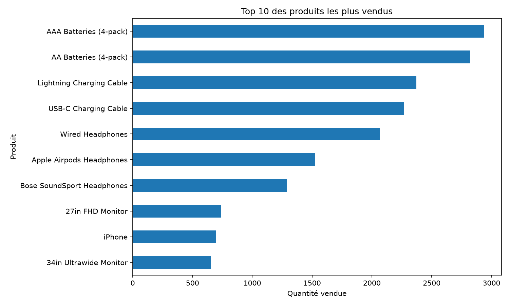
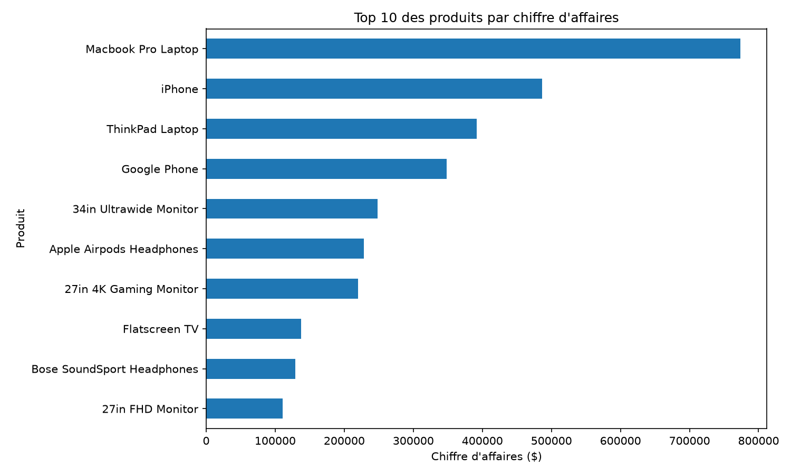
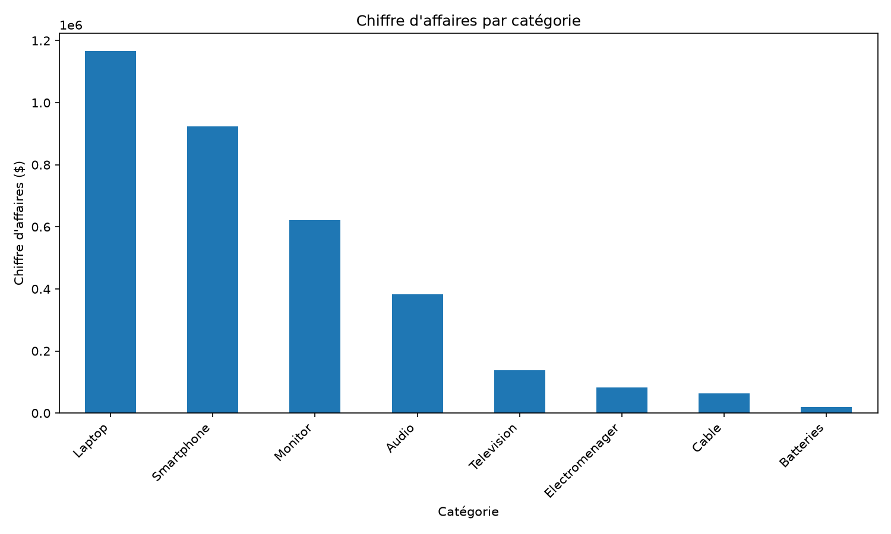
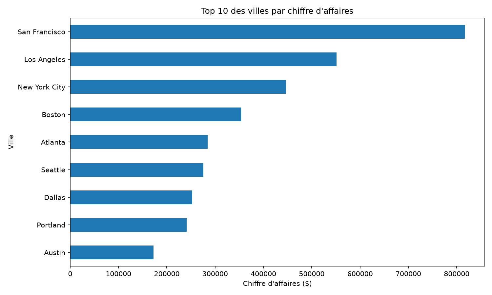
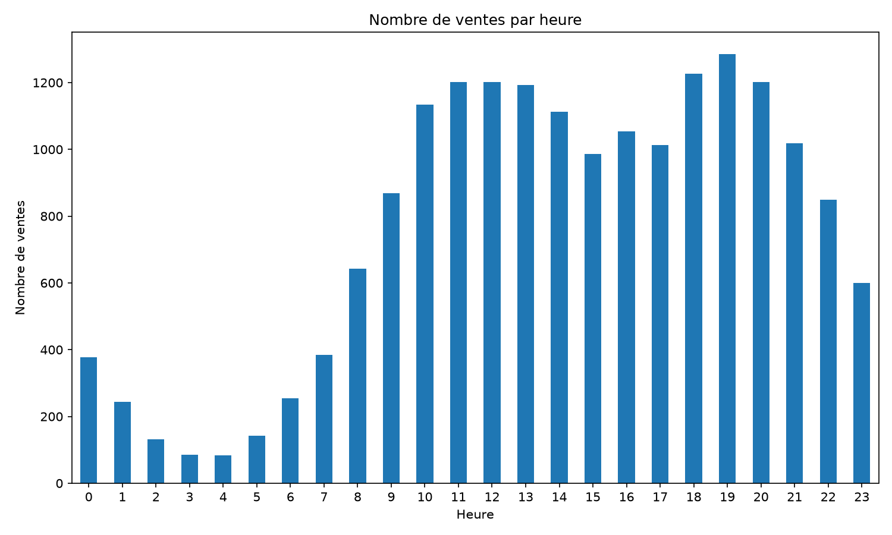

# 📊 Projet 2 — Analyse des ventes avec SQL

## 📌 Présentation du projet

Ce projet consiste à analyser les ventes d'une entreprise spécialisée dans les produits électroniques à partir du dataset `Sales_April_2019.csv`.

L'objectif est de mettre en pratique **SQL** pour contrôler la qualité des données, explorer les ventes, calculer des indicateurs commerciaux et extraire des informations utiles à la prise de décision.

L'analyse porte notamment sur :

- les produits les plus vendus ;
- le chiffre d'affaires ;
- les performances par catégorie ;
- les performances par ville ;
- les horaires de vente ;
- la qualité des données.

Le projet a été réalisé avec **MySQL**, **phpMyAdmin** et **WAMP**.  
Les résultats ont également été visualisés avec **Python**.

---

## 📊 Résultats clés

| Indicateur | Résultat |
|---|---:|
| 💰 Chiffre d'affaires total | **3 396 059,11 $** |
| 🥇 Produit générant le plus de CA | **Macbook Pro Laptop — 773 500 $** |
| 📦 Produit le plus vendu | **AAA Batteries (4-pack) — 2 936 unités** |
| 🏷️ Catégorie générant le plus de CA | **Laptop — 1 165 496,08 $** |
| 🌎 Ville générant le plus de CA | **San Francisco — 817 074,77 $** |
| ⏰ Heure avec le plus de ventes | **19h — 1 286 ventes** |
| 💵 CA réalisé à 19h | **249 265,71 $** |

### 💡 Principaux insights

- Les **Laptops** représentent la catégorie générant le plus de chiffre d'affaires.
- Le **Macbook Pro Laptop** est le produit générant le plus de revenus.
- Les **AAA Batteries (4-pack)** sont le produit vendu en plus grande quantité.
- **San Francisco** est la ville générant le plus de chiffre d'affaires.
- **19h** représente le pic de ventes et le créneau générant le plus de chiffre d'affaires.
- Le volume vendu et le chiffre d'affaires ne sont pas nécessairement corrélés : les produits à faible prix peuvent être vendus en grande quantité tout en générant moins de revenus.

---

## 🎯 Objectifs de l'analyse

L'analyse cherche à répondre aux questions suivantes :

1. Combien de lignes contient le jeu de données ?
2. Les données contiennent-elles des valeurs problématiques ?
3. Quels sont les produits les plus vendus ?
4. Quels produits génèrent le plus de chiffre d'affaires ?
5. Quelles catégories génèrent le plus de revenus ?
6. Quelle ville génère le plus de chiffre d'affaires ?
7. Quelles sont les heures auxquelles les ventes sont les plus importantes ?
8. Quels créneaux horaires génèrent le plus de chiffre d'affaires ?

---

## 🗂️ Jeu de données

**Fichier :** `Sales_April_2019.csv`

Le dataset contient les ventes réalisées au cours du mois d'avril 2019.

### Principales colonnes

| Colonne | Description |
|---|---|
| `order_id` | Identifiant de la commande |
| `product` | Produit vendu |
| `quantity_ordered` | Quantité commandée |
| `price_each` | Prix unitaire |
| `order_date` | Date et heure de la commande |
| `purchase_address` | Adresse d'achat |

Une table complémentaire `produits` a été créée afin d'associer chaque produit à une catégorie.

---

## 🗄️ Structure de la base de données

### Table `ventes`

```text
ventes

├── order_id
├── product
├── quantity_ordered
├── price_each
├── order_date
└── purchase_address
```

### Table `produits`

```text
produits

├── product
└── category
```

La relation entre les deux tables est :

```text
ventes.product = produits.product
```

Cette relation permet d'utiliser `JOIN` afin d'analyser les performances commerciales par catégorie.

---

# 🔍 1. Contrôle et nettoyage des données

Lors de l'importation, la table contenait :

**18 384 lignes.**

Le contrôle de qualité a identifié :

- **59 lignes avec un `order_id` vide** ;
- **95 lignes avec `quantity_ordered = 0`**.

Les 59 lignes avec un `order_id` vide sont comprises dans les 95 lignes identifiées comme invalides.

Après nettoyage :

**18 289 lignes valides** ont été conservées pour l'analyse.

Des contrôles supplémentaires ont ensuite confirmé :

- `order_id` vide : **0 ligne** ;
- `quantity_ordered = 0` : **0 ligne**.

> Le fichier CSV original `Sales_April_2019.csv` est conservé dans le projet. Le nettoyage concerne les données utilisées pour les analyses SQL.

### Exemple SQL

```sql
-- Nombre total de lignes importées
SELECT COUNT(*) AS nombre_lignes
FROM ventes;

-- Lignes avec un order_id vide
SELECT COUNT(*) AS order_id_vides
FROM ventes
WHERE order_id = '';

-- Lignes avec une quantité égale à zéro
SELECT COUNT(*) AS quantite_zero
FROM ventes
WHERE quantity_ordered = 0;
```

### 📸 Contrôle des données dans MySQL

Les contrôles et résultats obtenus dans phpMyAdmin sont disponibles dans le dossier `images/`.









---

# 📦 2. Analyse des produits

L'analyse des quantités vendues permet d'identifier les produits les plus demandés.

### 🥇 Produit le plus vendu

Le produit ayant enregistré la plus grande quantité vendue est :

**AAA Batteries (4-pack)**

→ **2 936 unités**

Les autres produits fortement vendus comprennent notamment :

- AA Batteries (4-pack) ;
- Lightning Charging Cable ;
- USB-C Charging Cable ;
- Wired Headphones.

### Requête SQL

```sql
SELECT
    product,
    SUM(quantity_ordered) AS quantite_vendue
FROM ventes
WHERE order_id != ''
  AND quantity_ordered > 0
  AND product != ''
GROUP BY product
ORDER BY quantite_vendue DESC;
```

### 📈 Visualisation — Quantités vendues par produit



---

# 💰 3. Chiffre d'affaires par produit

Le chiffre d'affaires est calculé selon la formule :

```text
Chiffre d'affaires = quantité vendue × prix unitaire
```

Le produit générant le plus de chiffre d'affaires est :

**Macbook Pro Laptop**

→ **773 500 $**

Cette analyse montre qu'un produit vendu en grande quantité n'est pas nécessairement celui qui génère le plus de revenus.

### Requête SQL

```sql
SELECT
    product,
    SUM(quantity_ordered * price_each) AS chiffre_affaires
FROM ventes
WHERE order_id != ''
  AND quantity_ordered > 0
  AND product != ''
GROUP BY product
ORDER BY chiffre_affaires DESC;
```

### 📈 Visualisation — Chiffre d'affaires par produit



---

# 💵 4. Chiffre d'affaires global

Le chiffre d'affaires total des données nettoyées est :

## **3 396 059,11 $**

Il est calculé avec :

```sql
SUM(quantity_ordered * price_each)
```

### Requête SQL

```sql
SELECT
    SUM(quantity_ordered * price_each) AS chiffre_affaires_total
FROM ventes
WHERE order_id != ''
  AND quantity_ordered > 0
  AND product != '';
```

Ce calcul permet d'obtenir le revenu généré par l'ensemble des ventes analysées.

---

# 🏷️ 5. Analyse par catégorie

La table `produits` permet d'associer chaque produit à une catégorie.

L'utilisation de `JOIN` permet ensuite d'analyser les performances commerciales par catégorie.

| Catégorie | Quantité vendue | Chiffre d'affaires |
|---|---:|---:|
| Laptop | 847 | 1 165 496,08 $ |
| Smartphone | 1 496 | 923 100,00 $ |
| Monitor | 2 350 | 622 466,50 $ |
| Audio | 4 879 | 382 308,46 $ |
| Television | 459 | 137 700,00 $ |
| Electromenager | 138 | 82 800,00 $ |
| Cable | 4 641 | 62 572,95 $ |
| Batteries | 5 758 | 19 615,12 $ |

### Requête SQL

```sql
SELECT
    produits.category,
    SUM(ventes.quantity_ordered) AS quantite_vendue,
    SUM(ventes.quantity_ordered * ventes.price_each) AS chiffre_affaires
FROM ventes
JOIN produits
    ON ventes.product = produits.product
WHERE ventes.order_id != ''
  AND ventes.quantity_ordered > 0
  AND ventes.product != ''
GROUP BY produits.category
ORDER BY chiffre_affaires DESC;
```

### 💡 Insight

La catégorie **Laptop** génère le chiffre d'affaires le plus élevé :

**1 165 496,08 $**

À l'inverse, la catégorie **Batteries** possède un volume de vente important mais génère un chiffre d'affaires beaucoup plus faible.

Cela illustre la différence entre **volume vendu** et **revenus générés**.

### 📈 Visualisation — Chiffre d'affaires par catégorie



---

# 🌎 6. Analyse géographique

La colonne `purchase_address` contient l'adresse complète du client.

La fonction `SUBSTRING_INDEX()` permet d'extraire la ville depuis cette adresse.

## Chiffre d'affaires par ville

| Ville | Chiffre d'affaires |
|---|---:|
| San Francisco | 817 074,77 $ |
| Los Angeles | 551 399,07 $ |
| New York City | 446 587,78 $ |
| Boston | 353 880,16 $ |
| Atlanta | 284 454,92 $ |
| Seattle | 276 010,24 $ |
| Dallas | 252 840,47 $ |
| Portland | 241 128,11 $ |
| Austin | 172 683,59 $ |

### Requête SQL

```sql
SELECT
    TRIM(
        SUBSTRING_INDEX(
            SUBSTRING_INDEX(purchase_address, ',', 2),
            ',',
            -1
        )
    ) AS ville,
    SUM(quantity_ordered * price_each) AS chiffre_affaires
FROM ventes
WHERE order_id != ''
  AND quantity_ordered > 0
  AND product != ''
  AND purchase_address != ''
GROUP BY ville
ORDER BY chiffre_affaires DESC;
```

### 💡 Insight

**San Francisco** est la ville générant le plus de chiffre d'affaires :

**817 074,77 $**

Elle est suivie par Los Angeles et New York City.

San Francisco représente également le plus grand nombre de transactions :

**4 437 ventes**

pour une quantité totale de :

**4 987 unités**.

### 📈 Visualisation — Chiffre d'affaires par ville



---

# ⏰ 7. Analyse temporelle

La colonne `order_date` contient la date et l'heure de chaque commande.

La fonction `STR_TO_DATE()` permet de convertir le texte en date/heure et `HOUR()` permet ensuite d'extraire l'heure.

## 🕐 Heure avec le plus de ventes

L'heure enregistrant le plus grand nombre de ventes est :

**19h — 1 286 ventes**

### Requête SQL

```sql
SELECT
    HOUR(
        STR_TO_DATE(order_date, '%m/%d/%y %H:%i')
    ) AS heure,
    COUNT(*) AS nombre_ventes
FROM ventes
WHERE order_id != ''
  AND quantity_ordered > 0
  AND product != ''
  AND order_date != ''
GROUP BY heure
ORDER BY nombre_ventes DESC;
```

### 💰 Chiffre d'affaires par heure

| Heure | Nombre de ventes | Chiffre d'affaires |
|---:|---:|---:|
| **19h** | **1 286** | **249 265,71 $** |
| 12h | 1 201 | 237 861,09 $ |
| 11h | 1 201 | 222 818,47 $ |
| 18h | 1 227 | 222 620,31 $ |
| 20h | 1 201 | 217 054,46 $ |

### Requête SQL

```sql
SELECT
    HOUR(
        STR_TO_DATE(order_date, '%m/%d/%y %H:%i')
    ) AS heure,
    COUNT(*) AS nombre_ventes,
    SUM(quantity_ordered * price_each) AS chiffre_affaires
FROM ventes
WHERE order_id != ''
  AND quantity_ordered > 0
  AND product != ''
  AND order_date != ''
GROUP BY heure
ORDER BY chiffre_affaires DESC;
```

### 💡 Insight

**19h** représente le créneau le plus performant dans les données étudiées :

- **1 286 ventes** ;
- **249 265,71 $ de chiffre d'affaires**.

Les périodes **11h–14h** et **18h–20h** présentent également une activité commerciale importante.

Ces résultats peuvent servir de base pour tester des campagnes marketing ou des promotions sur les créneaux les plus actifs.

### 📈 Visualisation — Nombre de ventes par heure



---

# 🧠 Principaux enseignements

### 🥇 Produit le plus vendu

**AAA Batteries (4-pack)**

→ **2 936 unités**

### 💰 Chiffre d'affaires total

**3 396 059,11 $**

### 💻 Catégorie la plus performante

**Laptop**

→ **1 165 496,08 $**

### 🌎 Ville la plus performante

**San Francisco**

→ **817 074,77 $**

### ⏰ Meilleure heure

**19h**

→ **1 286 ventes**

→ **249 265,71 $ de chiffre d'affaires**

---

# 🛠️ Compétences SQL utilisées

Ce projet m'a permis de mettre en pratique :

- `SELECT`
- `WHERE`
- `GROUP BY`
- `ORDER BY`
- `COUNT()`
- `SUM()`
- `JOIN`
- `AS`
- `STR_TO_DATE()`
- `HOUR()`
- `SUBSTRING_INDEX()`
- `TRIM()`
- calculs SQL ;
- agrégation de données ;
- contrôle de qualité des données ;
- analyse commerciale.

---

# 🐍 Visualisation avec Python

Les résultats issus des analyses SQL ont été complétés par des visualisations réalisées avec **Python** afin de faciliter l'interprétation des données.

Le script `visualisation_ventes.py` permet de générer automatiquement les graphiques à partir des données nettoyées.

### Visualisations réalisées

- Quantités vendues par produit ;
- Chiffre d'affaires par produit ;
- Chiffre d'affaires par catégorie ;
- Chiffre d'affaires par ville ;
- Nombre de ventes par heure.

Les graphiques sont disponibles dans le dossier `images/`.

---

# 🧰 Technologies utilisées

- **MySQL**
- **SQL**
- **Python**
- **Pandas**
- **Matplotlib**
- **phpMyAdmin**
- **WAMP**
- **CSV**

---

# 📁 Structure du projet

```text
Projet_SQL_Ventes/

│
├── analyse_ventes.sql
├── visualisation_ventes.py
├── README.md
├── Sales_April_2019.csv
│
└── images/
    ├── Capture1.PNG
    ├── Capture2.PNG
    ├── Capture3.PNG
    ├── Capture4.PNG
    ├── chiffre_affaires_par_categorie.png
    ├── chiffre_affaires_par_produit.png
    ├── chiffre_affaires_par_ville.png
    ├── ventes_par_heure.png
    └── ventes_par_produit.png
```

---

# 🎯 Conclusion

Cette analyse a permis d'étudier les performances commerciales du mois d'avril 2019 sous plusieurs angles :

- produits ;
- chiffre d'affaires ;
- catégories ;
- villes ;
- horaires ;
- qualité des données.

Les résultats montrent notamment que les **Laptops** génèrent la plus grande part du chiffre d'affaires, que **San Francisco** est la ville générant le plus de chiffre d'affaires dans le dataset et que **19h** représente le principal pic d'activité.

Ce projet démontre ma capacité à utiliser **SQL pour contrôler, explorer, agréger et interpréter des données afin de répondre à des questions métier**, ainsi qu'à utiliser **Python pour transformer les résultats en visualisations facilement exploitables**.